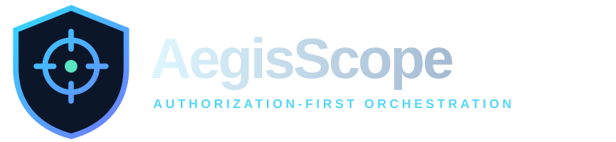
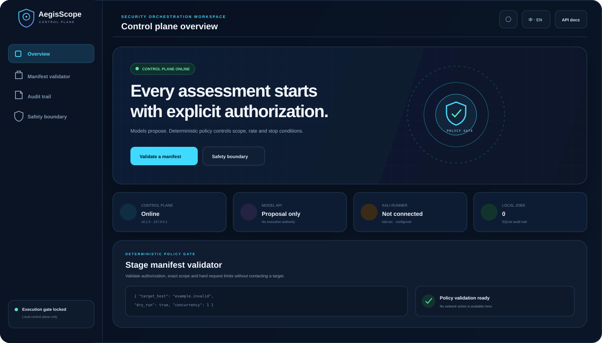
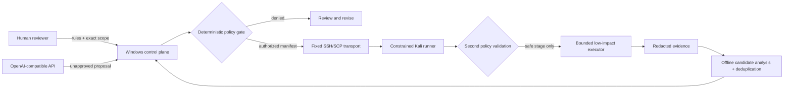

<div align="center">
  

  <p><strong>A bilingual, authorization-first control plane for lawful SRC and bug-bounty workflows.</strong></p>
  <p>Windows orchestration · constrained Kali runner · deterministic safety policy · human approval</p>

  <p>
    <a href="README.en.md"><strong>English</strong></a>
    ·
    <a href="README.md">简体中文</a>
  </p>

  <p>
    <a href="https://github.com/C-8H11N/aegis-scope/actions/workflows/ci.yml"></a>
    
    
    
    
    <a href="LICENSE"></a>
  </p>
</div>

<p align="center">
  
</p>

> [!IMPORTANT]
> AegisScope can automatically discover and rank vulnerability leads, but it is not an autonomous attack agent. Connecting a model API does not grant target authorization. The model can only create proposals; deterministic policy and explicit approval control every executable stage.

## One-click start on Windows

1. Download or clone this repository.
2. Double-click **[`Start-AegisScope.cmd`](Start-AegisScope.cmd)**.
3. On the first run, review and accept the isolated `.venv` dependency setup prompt.
4. The dashboard opens automatically at [`http://127.0.0.1:8765`](http://127.0.0.1:8765).
5. Press `Ctrl+C` in the launcher window to stop the service.

The first run creates an isolated virtual environment inside the repository and installs the project there. It does not replace or repair system Python, modify Windows networking, connect to Kali, or contact an SRC target. Later launches are one click.

```text
Start-AegisScope.cmd
        │
        ├─ first run → ask once → create .venv → install AegisScope
        └─ later runs ──────────→ start loopback Web UI → open browser
```

## Why AegisScope?

AI can improve planning, evidence triage, and report drafting, but it must not decide its own authorization. AegisScope separates those responsibilities into two layers:

- The **proposal layer** can reason about program rules and create a reviewable plan.
- The **policy layer** enforces exact scope, fixed methods, conservative limits, expiry, stop conditions, and explicit authorization.

The Windows control plane prepares and audits work. The Kali runner validates the same immutable manifest again before any allowed execution. Neither side accepts arbitrary model-generated shell commands.

## Dashboard

The local bilingual dashboard provides:

- Chinese/English language switching and light/dark themes;
- loopback control-plane, model configuration, runner configuration, and audit status;
- JSON import and deterministic stage-manifest validation;
- local job preparation only after policy validation succeeds;
- a SQLite-backed audit list;
- automatic candidate and observation counts from downloaded evidence;
- explicit wording that local preparation does not dispatch to Kali or contact a target.

The dashboard intentionally has **no direct target-execution button**.

## Core capabilities

| Area | Implemented behavior |
|---|---|
| Scope | Exact-host allowlist and denylist; no implicit subdomain or asset expansion |
| Contracts | Strict Pydantic models; unknown fields and unsafe URL forms are rejected |
| HTTP boundary | HTTPS `HEAD`, `GET`, and `OPTIONS` only |
| Rate limits | Concurrency `1`, delay `≥5s`, stage cap `≤20`, per-URL cap `≤2` |
| Network safety | No redirect following, authentication, cookies, tokens, bodies, or custom headers |
| Approval | Stage-scoped, time-bounded, exact user authorization statement |
| Model API | OpenAI-compatible proposal adapter with no execution authority |
| Evidence | Sensitive header/text redaction and bounded response collection |
| Auto triage | Offline ranking of directory listing, verbose error, source map, header, and CORS leads |
| Integrity | Cross-end manifest SHA-256, replay prevention, evidence indexes, and file hashes |
| Audit | Local SQLite job history plus structured runner output |
| Transport | Fixed OpenSSH/SCP argument arrays; no `shell=True` and no arbitrary shell channel |

## Architecture



No daemon or new listening port is required on Kali. The Windows app listens on loopback only.

## Safety boundary

### Supported

- Offline rule parsing, scope review, evidence redaction, comparison, and report drafting;
- strict manifest validation and local audit preparation;
- explicitly authorized, low-impact stage types supported by the fixed runner;
- dry-run demonstrations using the reserved `.invalid` namespace.

### Deliberately unsupported

- port scanning, subdomain enumeration, crawling, fuzzing, or directory brute force;
- password testing, credential attacks, bulk access, or data extraction;
- automatic exploitation, webshells, persistence, privilege escalation, or denial of service;
- scope expansion, cross-host redirect following, or arbitrary shell execution;
- unattended target testing based only on a domain or an API connection.

See [Security model](docs/security-model.md) and [Security policy](SECURITY.md).

## Recommended deployment

Use three clearly separated roles instead of installing every tool on one machine:

| Device | Install | Responsibility |
|---|---|---|
| Windows host | Full AegisScope control plane | Rules, scope, proposals, approval, audit, evidence organization, and reports |
| Windows test VM | Burp Suite, test browser, Wireshark | Manual capture, authenticated interaction, and UI validation; no runner required |
| Kali | Constrained runner under `~/src-runner` | Revalidate approved manifests, execute bounded stages, and return redacted results |

Normal operating sequence:

1. Clone the repository on the Windows host and run `Start-AegisScope.cmd`.
2. Import program rules and exact scope, then generate and review a stage manifest.
3. Use Burp manually in the Windows test VM when authentication or browser interaction is required.
4. Invoke the Kali runner through the existing `kali-src` SSH alias only after explicit stage authorization.
5. Download the runner output to Windows for evidence review and reporting.

The Windows host is the only control center. Kali does not run Codex, store model API keys, or expose a Web service.

## Requirements

### Windows control plane

- Windows 10/11;
- Python 3.11 or newer available as `python` in a normal terminal;
- PowerShell 5.1 or newer;
- OpenSSH client only when a separately authorized Kali dispatch is needed.

### Kali runner

- Python 3.11 or newer;
- an isolated environment under `~/src-runner`;
- SSH access configured by the user.

Kali deployment is optional for the dashboard, local validation, dry-run, and report work.

## Manual setup

If you prefer not to use the launcher:

```powershell
python -m venv .venv
.\.venv\Scripts\Activate.ps1
python -m pip install -e ".[dev]"
aegisscope init
aegisscope serve
```

Open `http://127.0.0.1:8765`.

Useful offline commands:

```powershell
aegisscope validate .\examples\safe-demo\stage.json
aegisscope runner-dry-run .\examples\safe-demo\stage.json
aegisscope analyze-evidence .\var\evidence\<job-id>
aegisscope recover-evidence <job-id>          # preview SCP-only recovery
aegisscope report-template --language en --output report.md
```

If a stage finished but evidence download failed, `recover-evidence <job-id> --execute`
re-downloads remote evidence only. It never invokes the runner or replays a target request,
and writes into a fresh, non-overwriting recovery directory.

The included demo targets `example.invalid` and remains `dry_run: true`.

## Configuration

Copy `.env.example` to a local `.env`. That file is ignored by Git.

| Variable | Purpose | Default |
|---|---|---|
| `AEGISSCOPE_DATA_DIR` | Local audit, jobs, proposals, and evidence | `./var` |
| `AEGISSCOPE_SSH_ALIAS` | Existing OpenSSH alias for the Kali node | `kali-src` |
| `AEGISSCOPE_REMOTE_ROOT` | Constrained remote workspace | `~/src-runner` |
| `AEGISSCOPE_LANGUAGE` | CLI language: `zh-CN` or `en` | `zh-CN` |
| `AEGISSCOPE_LLM_BASE_URL` | OpenAI-compatible API base URL | unset |
| `AEGISSCOPE_LLM_API_KEY` | API credential, local only | unset |
| `AEGISSCOPE_LLM_MODEL` | Model identifier | unset |

Never commit API keys, SSH private keys, cookies, tokens, real scope files, user data, or collected evidence.

## Repository layout

```text
aegis-scope/
├── Start-AegisScope.cmd       # Windows one-click launcher
├── src/aegisscope/
│   ├── web/                   # FastAPI control plane + dashboard
│   ├── policy/                # Deterministic authorization gate
│   ├── runner/                # Constrained Kali executor
│   ├── analysis/              # Offline candidate discovery, ranking, and deduplication
│   ├── transport/             # Fixed SSH/SCP transport
│   ├── providers/             # Proposal-only model adapters
│   └── contracts/             # Strict shared schemas
├── scripts/windows/           # Setup, launch, deploy, and dispatch helpers
├── examples/safe-demo/        # Permanent offline dry-run
├── tests/                     # Policy, runner, Web, redaction, transport tests
└── docs/                      # Architecture and security documentation
```

## API surface

Interactive documentation is available at `/docs` while the local service is running.

| Endpoint | Behavior |
|---|---|
| `GET /health` | Local control-plane health and version |
| `GET /api/v1/config` | Non-secret configuration status |
| `POST /api/v1/manifests/validate` | Deterministic validation, no dispatch |
| `POST /api/v1/jobs/prepare` | Store a validated job locally |
| `GET /api/v1/jobs` | Read local audit records |
| `POST /api/v1/jobs/{job_id}/analyze` | Analyze downloaded evidence offline; sends no requests |
| `POST /api/v1/proposals` | Create an unapproved model proposal |

## Development

```powershell
python -m pip install -e ".[dev]"
ruff check .
mypy src
pytest --cov=aegisscope
```

Pull requests are welcome. Read [Contributing](CONTRIBUTING.md), [Code of Conduct](CODE_OF_CONDUCT.md), and the repository [AGENTS.md](AGENTS.md) before changing safety-critical code.

## Project status

AegisScope is an alpha, offline-first foundation. It automatically discovers and deduplicates candidates and proposes minimal validation directions, but tool output remains a lead until a human validates server-side impact.

Planned work:

- Ed25519-signed manifests and trusted releases;
- Burp/HAR import, cross-stage evidence diffing, and duplicate detection;
- role-aware local approval records;
- improved mock-server and end-to-end safety tests;
- packaged Windows releases after the policy interface stabilizes.

## License

[Apache License 2.0](LICENSE). The license does not replace target authorization, program rules, or applicable law.
