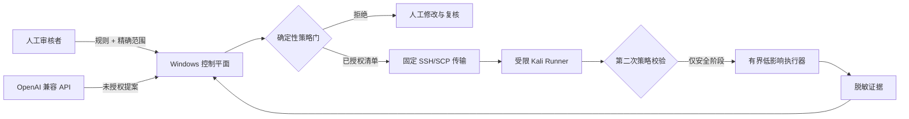

<div align="center">
  

  <p><strong>面向合法 SRC 与漏洞赏金工作的双语、授权优先安全控制平面。</strong></p>
  <p>Windows 编排 · 受限 Kali Runner · 确定性安全策略 · 人工授权</p>

  <p>
    <a href="README.en.md">English</a>
    ·
    <a href="README.md"><strong>简体中文</strong></a>
  </p>

  <p>
    <a href="https://github.com/C-8H11N/aegis-scope/actions/workflows/ci.yml"></a>
    
    
    
    
    <a href="LICENSE"></a>
  </p>
</div>

<p align="center">
  
</p>

> [!IMPORTANT]
> AegisScope 不是自动攻击 Agent。接入模型 API 不等于获得目标授权。模型只能生成待审提案，实际可执行阶段始终由确定性策略和用户的明确授权共同控制。

## Windows 一键启动

1. 下载或克隆本仓库；
2. 双击 **[`Start-AegisScope.cmd`](Start-AegisScope.cmd)**；
3. 首次运行时阅读提示，确认在项目内创建独立 `.venv` 并安装依赖；
4. 浏览器会自动打开 [`http://127.0.0.1:8765`](http://127.0.0.1:8765)；
5. 在启动窗口按 `Ctrl+C` 停止服务。

首次运行只会在仓库内部创建虚拟环境并安装本项目，不会替换或修复系统 Python，不会修改 Windows 网络，不会连接 Kali，也不会访问任何 SRC 目标。之后每次都是双击启动。

```text
Start-AegisScope.cmd
        │
        ├─ 首次运行 → 统一确认 → 创建 .venv → 安装 AegisScope
        └─ 后续运行 ─────────→ 启动本地 Web UI → 自动打开浏览器
```

## 为什么开发 AegisScope？

AI 可以提升测试规划、证据分析和报告整理效率，但它不能为自己授予测试权限。AegisScope 将责任明确分成两层：

- **提案层**读取项目规则与精确范围，生成可人工检查的方案；
- **策略层**强制执行精确主机、固定方法、保守速率、有效期、停止条件和明确授权。

Windows 控制平面负责编排与审计；Kali Runner 在允许执行前，会再次校验同一份不可扩展清单。任何一端都不接受模型生成的任意 Shell 命令。

## 可视化控制台

本地双语控制台目前提供：

- 中英文切换以及明暗主题；
- 控制平面、模型配置、Runner 配置和本地审计状态；
- JSON 清单导入与确定性策略校验；
- 只有校验通过后才允许在本地准备任务；
- 基于 SQLite 的任务审计列表；
- 清楚标注“本地准备”不会连接 Kali 或访问目标。

控制台刻意**不提供直接执行真实目标请求的按钮**。

## 核心能力

| 方向 | 已实现行为 |
|---|---|
| 范围 | 精确主机 allowlist/denylist，不自动扩大到子域名或关联资产 |
| 协议 | 严格 Pydantic 模型，拒绝未知字段和不安全 URL 形式 |
| HTTP 边界 | 仅允许 HTTPS `HEAD`、`GET`、`OPTIONS` |
| 速率限制 | 并发 `1`、间隔 `≥5 秒`、单阶段 `≤20`、单 URL `≤2` |
| 网络安全 | 不跟随重定向，不允许认证、Cookie、Token、正文和自定义请求头 |
| 授权 | 阶段级、限时、记录用户明确授权原文 |
| 模型 API | 兼容 OpenAI 风格 API，但仅能生成未授权提案 |
| 证据 | 敏感头和正文脱敏，响应体大小受限 |
| 审计 | Windows 本地 SQLite 任务历史与结构化 Runner 输出 |
| 传输 | 固定 OpenSSH/SCP 参数数组，不使用 `shell=True` 或任意 Shell 通道 |

## 架构



Kali 不需要运行常驻 Web 服务或开放新端口；Windows Web 服务只监听本机回环地址。

## 安全边界

### 支持

- 离线规则整理、范围复核、证据脱敏、差异分析和报告起草；
- 严格清单校验与本地审计准备；
- Runner 固定支持且已单独授权的低影响阶段；
- 使用保留 `.invalid` 域名的永久 dry-run 演示。

### 明确不支持

- 端口扫描、子域名枚举、爬虫、模糊测试和目录爆破；
- 密码测试、凭据攻击、批量访问或数据提取；
- 自动漏洞利用、WebShell、持久化、提权和拒绝服务；
- 自动扩大范围、跟随跨主机重定向或执行任意 Shell 命令；
- 仅凭一个域名或已接入 API 就无人值守测试真实目标。

详见[安全模型](docs/security-model.md)与[安全策略](SECURITY.zh-CN.md)。

## 推荐部署方式

建议采用三端分工，而不是把全部工具装在同一台机器：

| 设备 | 安装内容 | 主要职责 |
|---|---|---|
| Windows 本机 | 完整 AegisScope 控制平面 | 规则、范围、提案、授权、任务审计、证据整理与报告 |
| Windows 测试虚拟机 | Burp Suite、测试浏览器、Wireshark | 人工抓包、登录态操作和界面验证；无需安装 AegisScope Runner |
| Kali | `~/src-runner` 下的受限 Runner | 接收经过授权的固定清单、再次校验、低频执行并返回脱敏结果 |

日常使用顺序：

1. 在 Windows 本机克隆仓库并双击 `Start-AegisScope.cmd`；
2. 在控制台导入规则和精确范围，生成并人工审核阶段清单；
3. 需要登录态或浏览器交互时，在 Windows 测试虚拟机中用 Burp 人工完成；
4. 只有阶段已经明确授权时，才通过现有 SSH 别名 `kali-src` 调用 Kali Runner；
5. 将 Kali 输出下载回 Windows，本地完成证据复核和报告整理。

Windows 本机是唯一控制中心。Kali 不安装 Codex，不保存 API Key，也不运行对外 Web 服务。

## 环境要求

### Windows 控制平面

- Windows 10/11；
- 普通终端中的 `python` 为 Python 3.11 或更高版本；
- PowerShell 5.1 或更高版本；
- 只有在另行授权向 Kali 调度时才需要 OpenSSH 客户端。

### Kali Runner

- Python 3.11 或更高版本；
- `~/src-runner` 下的独立运行环境；
- 由用户自行配置的 SSH 访问。

仅使用控制台、本地校验、dry-run 和报告功能时，不需要部署或连接 Kali。

## 手动安装

如果不想使用一键启动器：

```powershell
python -m venv .venv
.\.venv\Scripts\Activate.ps1
python -m pip install -e ".[dev]"
aegisscope init
aegisscope serve
```

浏览器访问 `http://127.0.0.1:8765`。

常用离线命令：

```powershell
aegisscope validate .\examples\safe-demo\stage.json
aegisscope runner-dry-run .\examples\safe-demo\stage.json
aegisscope report-template --language zh-CN --output report.md
```

内置演示使用 `example.invalid`，并永久保持 `dry_run: true`。

## 配置

将 `.env.example` 复制为本地 `.env`，该文件已被 Git 忽略。

| 变量 | 用途 | 默认值 |
|---|---|---|
| `AEGISSCOPE_DATA_DIR` | 本地审计、任务、提案与证据目录 | `./var` |
| `AEGISSCOPE_SSH_ALIAS` | 已存在的 Kali OpenSSH 别名 | `kali-src` |
| `AEGISSCOPE_REMOTE_ROOT` | 受限远程工作目录 | `~/src-runner` |
| `AEGISSCOPE_LANGUAGE` | CLI 语言：`zh-CN` 或 `en` | `zh-CN` |
| `AEGISSCOPE_LLM_BASE_URL` | OpenAI 兼容 API 地址 | 未设置 |
| `AEGISSCOPE_LLM_API_KEY` | 仅保存在本地的 API 凭据 | 未设置 |
| `AEGISSCOPE_LLM_MODEL` | 模型名称 | 未设置 |

不要向仓库提交 API Key、SSH 私钥、Cookie、Token、真实范围文件、用户数据或测试证据。

## 项目结构

```text
aegis-scope/
├── Start-AegisScope.cmd       # Windows 一键启动入口
├── src/aegisscope/
│   ├── web/                   # FastAPI 控制平面与可视化页面
│   ├── policy/                # 确定性授权策略门
│   ├── runner/                # 受限 Kali 执行器
│   ├── transport/             # 固定 SSH/SCP 传输
│   ├── providers/             # 仅提案模型适配器
│   └── contracts/             # 严格共享协议
├── scripts/windows/           # 安装、启动、部署与调度脚本
├── examples/safe-demo/        # 永久离线 dry-run
├── tests/                     # 策略、Runner、Web、脱敏和传输测试
└── docs/                      # 架构与安全文档
```

## API

本地服务运行后，可在 `/docs` 查看交互式文档。

| 接口 | 行为 |
|---|---|
| `GET /health` | 本地控制平面状态与版本 |
| `GET /api/v1/config` | 不含密钥的配置状态 |
| `POST /api/v1/manifests/validate` | 确定性校验，不调度 |
| `POST /api/v1/jobs/prepare` | 在本地保存已校验任务 |
| `GET /api/v1/jobs` | 读取本地审计记录 |
| `POST /api/v1/proposals` | 生成未授权模型提案 |

## 开发与测试

```powershell
python -m pip install -e ".[dev]"
ruff check .
mypy src
pytest --cov=aegisscope
```

欢迎提交 Pull Request。修改安全关键代码前，请先阅读[贡献指南](CONTRIBUTING.zh-CN.md)、[行为准则](CODE_OF_CONDUCT.md)和仓库根目录的 [AGENTS.md](AGENTS.md)。

## 项目状态

AegisScope 当前处于 Alpha、离线优先阶段。项目优先关注策略正确性、可审阅性、证据最小化和清晰的操作体验，而不是提高自动化攻击强度。

后续计划：

- 清单签名与传输完整性校验；
- 更完整的离线证据复核和报告工作流；
- 带角色信息的本地授权记录；
- 更完善的 Mock Server 与端到端安全测试；
- 策略接口稳定后的 Windows 打包版本。

## 许可证

[Apache License 2.0](LICENSE)。开源许可证不能替代目标授权、SRC 项目规则或适用法律。
